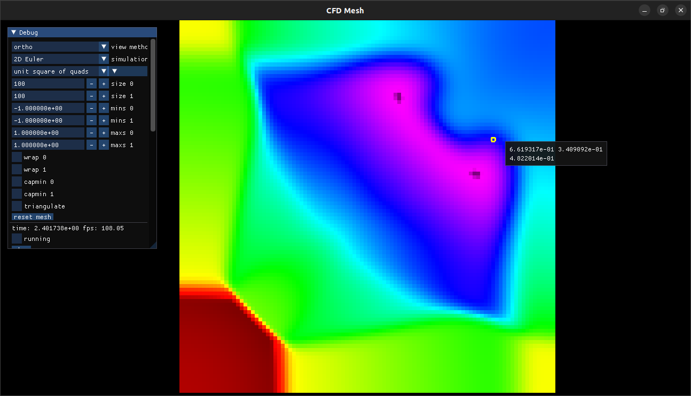

## CFDMesh

My C++ version of a CFD project, centered around unstructured meshes.
I was especially trying to get the NACA 0012 airfoil simulations working.
I forget if I did in here or in my hydro-cl-lua project.

